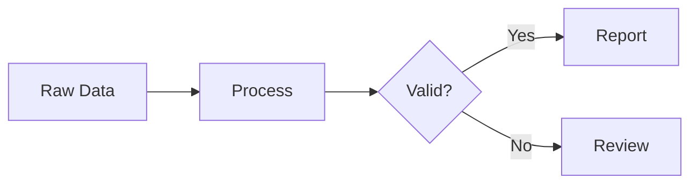

# /slides — Create, Convert, and Validate Presentation Slides

Create MARP markdown slide decks and convert to PDF, HTML, and/or PPTX with visual validation.

## Arguments

$ARGUMENTS — One of:
- A markdown file path + optional format flags: `/slides deck.md pptx`
- `new <path>` to create a new deck: `/slides new analysis/talk.md`
- `diagram <mermaid_code_or_file>` to render a Mermaid diagram to PNG

## Modes

### Mode 1: Convert existing slides

If the first argument is an existing `.md` file, convert it to the requested formats (default: all).

Formats: `pdf`, `html`, `pptx`, `gslides`, `all`

**PDF/HTML** (via MARP CLI):
```bash
npx @marp-team/marp-cli "$MD_PATH" --pdf --allow-local-files -o "${MD_PATH%.md}.pdf"
npx @marp-team/marp-cli "$MD_PATH" --html --allow-local-files -o "${MD_PATH%.md}.html"
```

**PPTX** (via python-pptx converter):
```bash
marp_to_pptx.py "$MD_PATH" "${MD_PATH%.md}.pptx"
```

After PPTX generation, run visual validation (see Validation section below).

**Google Slides** (`gslides`): Generate PPTX first, then upload to Google Drive with auto-conversion. **Never use the MCP `create_slides`/`update_slides` tools** — they only support plain text with no tables or formatting.

Requires these environment variables (or pass inline):
- `GOOGLE_CLIENT_ID` — OAuth 2.0 client ID
- `GOOGLE_CLIENT_SECRET` — OAuth 2.0 client secret
- `GOOGLE_REFRESH_TOKEN` — OAuth 2.0 refresh token with `drive.file` scope

```bash
# 1. Generate PPTX (same as above)
marp_to_pptx.py "$MD_PATH" "${MD_PATH%.md}.pptx"

# 2. Get OAuth access token
TOKEN_RESP=$(curl -s -X POST https://oauth2.googleapis.com/token \
  -d "client_id=$GOOGLE_CLIENT_ID" \
  -d "client_secret=$GOOGLE_CLIENT_SECRET" \
  -d "refresh_token=$GOOGLE_REFRESH_TOKEN" \
  -d "grant_type=refresh_token")
ACCESS_TOKEN=$(echo "$TOKEN_RESP" | python3 -c "import sys,json; print(json.load(sys.stdin)['access_token'])")

# 3. Upload PPTX with mimeType conversion to Google Slides
curl -s -X POST \
  -H "Authorization: Bearer $ACCESS_TOKEN" \
  -F "metadata={\"name\": \"$TITLE\", \"mimeType\": \"application/vnd.google-apps.presentation\"};type=application/json;charset=UTF-8" \
  -F "file=@${MD_PATH%.md}.pptx;type=application/vnd.openxmlformats-officedocument.presentationml.presentation" \
  "https://www.googleapis.com/upload/drive/v3/files?uploadType=multipart&supportsAllDrives=true" \
  | python3 -c "import sys,json; d=json.load(sys.stdin); print('https://docs.google.com/presentation/d/%s/edit' % d['id'])"
```

The `mimeType: application/vnd.google-apps.presentation` in metadata triggers auto-conversion from PPTX to native Google Slides format, preserving tables, formatting, and theming.

### Mode 2: Create new slide deck

If first argument is `new`, create a new MARP markdown file with the teal/white theme template. Ask the user for the topic and outline, then generate the slides.

### Mode 3: Render Mermaid diagram

If first argument is `diagram`, render Mermaid markup to PNG for embedding in slides:
```bash
npx -p @mermaid-js/mermaid-cli mmdc -i diagram.mmd -o diagram.png -t neutral -b transparent -w 800
```

## Slide Authoring Guide

When creating or editing MARP slides, follow these guidelines.

### Theme Template

Always start with this frontmatter for the teal/white theme:

```yaml
---
marp: true
theme: uncover
paginate: true
size: 16:9
style: |
  :root {
    --color-background: #ffffff;
    --color-foreground: #2d3436;
    --color-highlight: #00788a;
  }
  section { font-family: 'Helvetica Neue', Arial, sans-serif; font-size: 22px; padding: 40px 60px; }
  h1 { font-size: 32px; color: #00788a; border-bottom: 2px solid #00788a; padding-bottom: 8px; }
  h2 { font-size: 26px; color: #00788a; }
  table { font-size: 17px; }
  th { background: #00788a; color: white; padding: 6px 12px; }
  td { padding: 4px 12px; border-bottom: 1px solid #ddd; }
  strong { color: #00788a; }
  code { font-size: 15px; background: #f5f6fa; }
  .columns { display: flex; gap: 40px; }
  .columns > div { flex: 1; }
---
```

### Slide Structure

- Use `---` between slides (with blank lines before and after)
- First slide should be `<!-- _class: lead -->` for centered title
- Use `# Title` for slide titles (one per slide)
- Use `## Subtitle` for section headings within slides
- Keep content concise: max 6-8 bullet points per slide

### Two-Column Layout

```html
<div class="columns">
<div>

Left column content here.

</div>
<div>

Right column content here.

</div>
</div>
```

IMPORTANT: Leave blank lines between the `<div>` tags and the markdown content. Without blank lines, MARP won't parse the markdown inside the divs.

### Tables

Use standard markdown tables. Use `**bold**` for emphasis (renders in teal):

```markdown
| Metric | Value |
|--------|-------|
| Accuracy | **95%** |
| Sensitivity | **89%** (178/200) |
```

Keep tables to 5-6 columns max. For wider data, use two-column layout with two smaller tables.

### Images

```markdown

```

The `w:500` sets width in pixels. For two-column layouts, use `w:480` or smaller. Images must be in the same directory or use relative paths.

### Mermaid Diagrams

MARP doesn't support Mermaid natively. Pre-render diagrams to PNG:

1. Write diagram in a `.mmd` file:


2. Render to PNG:
```bash
npx -p @mermaid-js/mermaid-cli mmdc -i diagram.mmd -o diagram.png -t neutral -b transparent -w 800
```

3. Embed in slide:
```markdown

```

Supported diagram types: flowchart, sequence, class, state, ER, gantt, pie, mindmap, timeline, gitgraph.

### Code Blocks

Use fenced code blocks. Keep code short (8-10 lines max per slide):

````markdown
```python
# Short, focused code example
result = compute(data)
```
````

### Content Density Rules

- **Title slide**: Title + subtitle + author/date only
- **Results slide**: 1-2 tables + 2-3 bullet takeaways
- **Explanation slide**: 4-6 bullets with bold key terms
- **Data slide**: 1 table or chart + brief caption
- **Code slide**: 1 code block + 3-4 explanation bullets
- **Two-column slide**: Balance content roughly evenly; each column should stand alone

### HTML Entities

Use HTML entities for special characters:
- `&mdash;` for em-dash (—)
- `&rarr;` for right arrow (→)
- `&ge;` / `&le;` for comparison (≥, ≤)
- `&lt;` / `&gt;` for angle brackets in text

### Slide Overflow Prevention

- Use `<style scoped>table { font-size: 0.75em; }</style>` for dense tables
- Max 3 bullet points + 1 table per slide, OR 1 table + 2-line summary
- If a slide overflows, split into two slides — never rely on content being clipped
- Test by rendering PDF and visually checking every page

### Mermaid in PDF: Pre-Render Only

**Never use inline `<script>` tags for Mermaid in MARP slides.** Inline mermaid scripts:
- Create blank pages in marp-cli PDF output
- Require `html: true` which causes other rendering artifacts
- Don't reliably execute in marp-cli's Chromium context

**Always pre-render to PNG** (see Mode 3 above), then embed as an image. For simple flows, consider a table-based layout instead — it's more reliable and renders identically across PDF/HTML/PPTX.

### Common Mistakes to Avoid

1. **No blank lines around div tags** — MARP won't parse markdown inside
2. **Too much content per slide** — split into multiple slides
3. **Tables wider than column** — reduce columns or use abbreviations
4. **Missing `---` separator** — content bleeds into previous slide
5. **Images with absolute paths** — use relative paths for portability
6. **Inline mermaid `<script>` tags** — create blank pages in PDF (pre-render to PNG)
7. **`html: true` in frontmatter** — avoid unless strictly needed; causes rendering artifacts
8. **PDFs over 512KB** — may fail pre-commit large file hooks; keep slide count reasonable

## PPTX Visual Validation

After PPTX generation, validate by exporting to images and reading them:

**Export via Keynote (macOS):**
```applescript
osascript -e '
tell application "Keynote"
    open POSIX file "<pptx_path>"
    delay 2
    export front document to POSIX file "<dir>/slide_images" as slide images with properties {image format:PNG}
    close front document saving no
end tell
'
```

**Check each slide image for:**
- Text overlapping other text or tables
- Content extending beyond slide boundaries
- Tables with headers overlapping rows
- Empty slides with no visible content
- Broken image placeholders

**If issues found:**
1. Identify the spacing issue in the `marp_to_pptx.py` converter
2. Fix the converter (usually increase gap constants)
3. Regenerate and re-validate
4. Repeat up to 3 times

**Cleanup:** Remove `slide_images/` directory after validation.

## Setup

### Requirements

- Node.js (for MARP CLI and Mermaid CLI)
- Python 3.9+ with `python-pptx` installed (`pip install python-pptx`)
- Keynote (macOS, for PPTX visual validation — optional)

### Google Slides Upload (Optional)

To use the `gslides` format, set these environment variables:

```bash
export GOOGLE_CLIENT_ID="your-client-id"
export GOOGLE_CLIENT_SECRET="your-client-secret"
export GOOGLE_REFRESH_TOKEN="your-refresh-token"
```

You need a Google Cloud project with the Drive API enabled and an OAuth 2.0 client configured with the `drive.file` scope. See [Google's OAuth 2.0 guide](https://developers.google.com/identity/protocols/oauth2) for setup instructions.

## Notes

- MARP PDF/HTML use CSS styling natively — they always look correct
- PPTX uses a custom python-pptx converter that approximates the theme
- Google Slides renders text boxes larger than Keynote — the converter uses generous spacing to account for this
- `python-pptx` must be installed: `pip install python-pptx`
- Mermaid CLI: `npx -p @mermaid-js/mermaid-cli mmdc`
